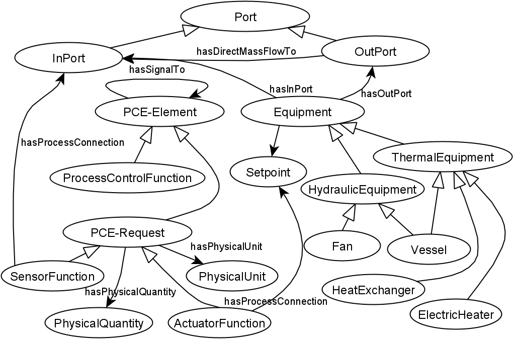

# PETIont
Plant Equipment, Topology, and Instrumentation Ontology is based on industrials standards like IEC 62424 (PCE request) and EN ISO 10628 for naming the equipment.

The following figure shows some of the main concepts of PETIont:
